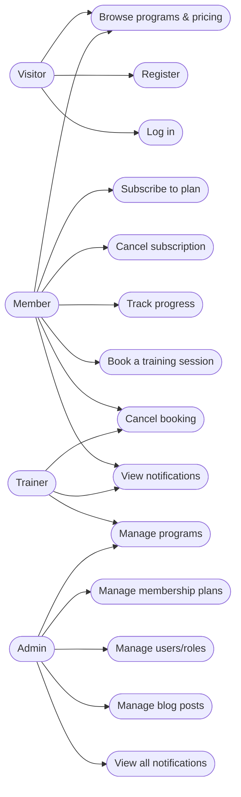
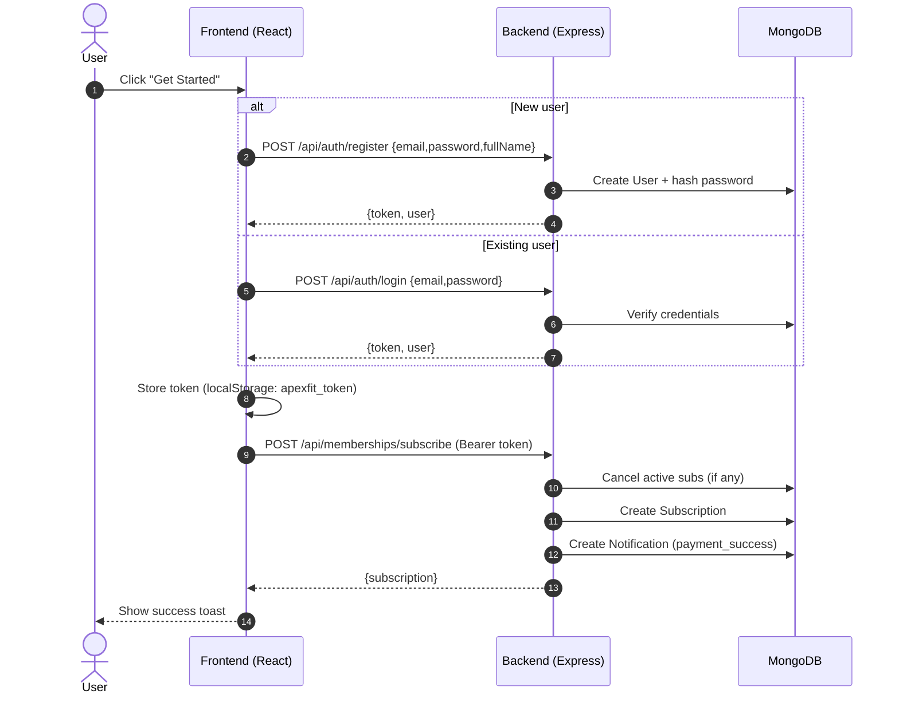
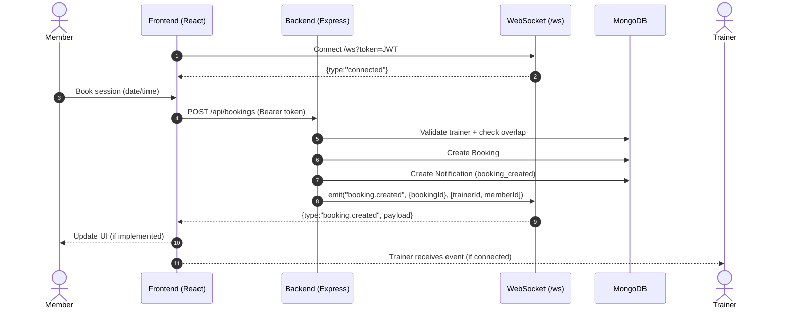

# FUTURE_FS_03 (ApexFit)

Full‑stack fitness membership platform:

- **Frontend**: Vite + React + TypeScript + Tailwind (shadcn/ui)
- **Backend**: Node.js + Express + MongoDB (Mongoose) + JWT auth
- **Realtime**: WebSocket (`/ws`) for server events (e.g., booking updates)

## Key Features

**Implemented in the API**

- Authentication: register, login, current user (`/api/auth/*`)
- Membership plans + subscriptions (subscribe/cancel) (`/api/memberships/*`)
  - On first run, seeds default membership plans if none exist
- Programs catalog (admin/trainer create; public list) (`/api/programs`)
- Bookings (member create; member/trainer/admin cancel; realtime emits) (`/api/bookings`)
- Progress tracking (daily entries + summary) (`/api/progress`)
- Blog posts (public read; admin CRUD) (`/api/blog/*`)
- Notifications inbox (per-user; admin can list all) (`/api/notifications*`)

**Implemented in the current UI**

- Marketing landing page (programs/trainers/pricing/testimonials)
- “Get Started” flow: **Sign up / Log in → Subscribe to a plan**

## Use Case Diagram

> Mermaid “use case” isn’t consistently supported everywhere, so this uses a simple flowchart-style use-case diagram.



## Architecture Diagram

```mermaid
flowchart LR
  user([User Browser])

  subgraph FE[Frontend]
    fe[Vite + React (TS)
Tailwind + shadcn/ui]
  end

  subgraph BE[Backend]
    api[Express API
(/api/*)]
    ws[WebSocket server
(/ws)]
  end

  db[(MongoDB)]
  secret[[JWT_SECRET (.env)]]

  user -- HTTP --> fe
  fe -- REST /api --> api
  fe -- WS /ws?token=JWT --> ws
  api -- Mongoose --> db
  api -- signs/verifies JWT --> secret
  ws -- jwt.verify(token) --> secret
  api -- emits events --> ws

  note1[[Vite dev proxy:
/api -> http://localhost:4000
/ws  -> ws://localhost:4000]]
  fe --- note1
```

## Sequence Diagrams

### 1) Register/Login → Subscribe



### 2) Member books a session → realtime event



## Project Structure

```
backend/   # Express API, MongoDB models, routes, realtime WS
frontend/  # Vite + React UI
```

## Getting Started

### Prerequisites

- Node.js 18+ (recommended)
- MongoDB connection string (local MongoDB or Atlas)

### 1) Backend setup

```bash
cd backend
npm install
cp .env.example .env
npm run dev
```

PowerShell alternative:

```powershell
cd backend
npm install
Copy-Item .env.example .env
npm run dev
```

Backend runs at `http://localhost:4000`.

### 2) Frontend setup

```bash
cd frontend
npm install
npm run dev
```

Frontend runs at `http://localhost:8080` and proxies:

- `/api` → `http://localhost:4000`
- `/ws` → `ws://localhost:4000`

## Environment Variables (Backend)

Create `backend/.env`:

| Name             | Required | Example                                       |
| ---------------- | -------: | --------------------------------------------- |
| `MONGODB_URI`    |       ✅ | `mongodb://127.0.0.1:27017/apexfit`           |
| `JWT_SECRET`     |       ✅ | `change-me-to-a-long-random-secret`           |
| `JWT_EXPIRES_IN` |       ❌ | `7d`                                          |
| `PORT`           |       ❌ | `4000`                                        |
| `CORS_ORIGIN`    |       ❌ | `http://localhost:8080,http://localhost:5173` |

## API Overview

Health

- `GET /api/health`

Auth

- `POST /api/auth/register`
- `POST /api/auth/login`
- `GET /api/auth/me` (Bearer token)

Memberships

- `GET /api/memberships/plans`
- `POST /api/memberships/subscribe` (Bearer token)
- `POST /api/memberships/cancel` (Bearer token)

Programs

- `GET /api/programs`
- `POST /api/programs` (trainer/admin)
- `PATCH /api/programs/:id` (trainer/admin)
- `DELETE /api/programs/:id` (admin)

Bookings

- `GET /api/bookings` (Bearer token)
- `POST /api/bookings` (member)
- `POST /api/bookings/:id/cancel` (Bearer token)

Progress

- `GET /api/progress` (Bearer token)
- `PUT /api/progress` (Bearer token)
- `GET /api/progress/summary` (Bearer token)

Blog

- `GET /api/blog/posts`
- `GET /api/blog/posts/:slug`
- `POST /api/blog/posts` (admin)
- `PATCH /api/blog/posts/:id` (admin)
- `DELETE /api/blog/posts/:id` (admin)

Notifications

- `GET /api/notifications` (Bearer token)
- `POST /api/notifications/:id/read` (Bearer token)
- `DELETE /api/notifications/:id` (Bearer token)
- `GET /api/admin/notifications` (admin)

## Realtime (WebSocket)

Connect:

- `ws://<host>/ws?token=<JWT>`

Messages:

- `connected` (server confirms connection)
- `error` (e.g., unauthorized)
- `booking.created`, `booking.canceled` (emitted on booking changes)

---

If you want, I can also add an **ER diagram** (MongoDB collections) using Mermaid `erDiagram` based on the models in `backend/src/models/`.
